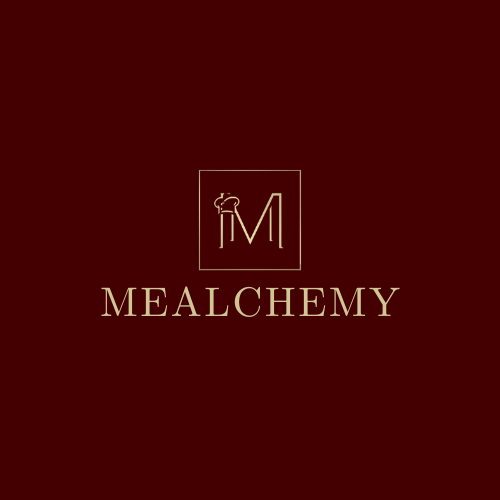

<p align="center">
  
</p>

# PUL5E - Mealchemy - An intelligent recipe management and discovery ecosystem

> Mealchemy eliminates meal-time indecision by transforming your available ingredients into personalised, shoppable culinary experiences. It serves as both a digital recipe vault and an intelligent discovery engine, bridging the gap between what is in your pantry and what ends up on your plate.

---

## Badges

### Build and Coverage

[](https://codecov.io/gh/COS301-SE-2026/Mealchemy)
[](https://codecov.io/gh/COS301-SE-2026/Mealchemy)
[](https://codecov.io/gh/COS301-SE-2026/Mealchemy)


### Repository
[](https://github.com/COS301-SE-2026/Mealchemy/issues)
[](https://stats.uptimerobot.com/wnmHUXyJfN)

### Tech Stack


---

## Links

| Resource | Link |
|---|---|
| GitHub Project Board | [Project Board](https://github.com/orgs/COS301-SE-2026/projects/67) |
| Wiki | [Wiki Home](https://github.com/COS301-SE-2026/Mealchemy/wiki) |
| Team Email | [pulsefive@gmail.com](mailto:pulsefive@gmail.com) |

## Deployed Links

| Service | Link |
|---|---|
| Backend (production) | [Deployed Backend Production](https://mealchemy-backend-prod-otygypdv7a-ey.a.run.app)
| Backend (staging) | [Deployed Backend Staging](https://mealchemy-backend-staging-otygypdv7a-ey.a.run.app) |
| Landing page | [Static-Landing-Page](https://mealchemy-firebase.web.app/)
| Android app | [Android App download](https://appdistribution.firebase.dev/i/9aea731b3a1ce2f6)|
| Brand style guide | [Brand Guide](ttps://cos301-se-2026.github.io/Mealchemy/) 

---

## Documentation

<details>
  <summary>Demo 2 - Click to expand</summary>

### Software Requirements Specifications (SRS)

| Page | Description |
|------|-------------|
| [Introduction](https://github.com/COS301-SE-2026/Mealchemy/wiki/SRS-Introduction-Demo-2) | Project background, motivation, and scope |
| [User Stories](https://github.com/COS301-SE-2026/Mealchemy/wiki/User-Stories-and-Characteristics-Demo-2) | Intended users and how they interact with the system |
| [Use Cases](https://github.com/COS301-SE-2026/Mealchemy/wiki/Use-Cases-Demo-2) | High-level use case diagrams and descriptions |
| [Functional Requirements](https://github.com/COS301-SE-2026/Mealchemy/wiki/Functional-Requirements-Demo-2) | Feature breakdown by subsystem |
| [Non-Functional Requirements](https://github.com/COS301-SE-2026/Mealchemy/wiki/Non‐Functional-Requirements-Demo-2) | Feature breakdown by subsystem |
| [Domain Model](https://github.com/COS301-SE-2026/Mealchemy/wiki/Domain-Model-Demo-2) | UML class diagram |

### Software Architecture Specifications (SAS)

| Page | Description |
|------|-------------|
| [Introduction](https://github.com/COS301-SE-2026/Mealchemy/wiki/SAS-Introduction-Demo-2) | Project background, motivation, and scope |
| [Architectural Requirements](https://github.com/COS301-SE-2026/Mealchemy/wiki/Architectural-Requirements-Demo-2) | Intended users and how they interact with the system |
| [Technology Requirements](https://github.com/COS301-SE-2026/Mealchemy/wiki/Technology-Requirements-Demo-2) | Technology Requirements |
| [API Service Contracts](https://github.com/COS301-SE-2026/Mealchemy/wiki/API-Service-Contracts-Demo-2) | API Contracts |
| [Deployment](https://github.com/COS301-SE-2026/Mealchemy/wiki/Deployment-Demo-2) | Deployment |

### Other Documents

| Page | Description |
|------|-------------|
| [Coding Standards Document](https://github.com/COS301-SE-2026/Mealchemy/wiki/Coding-Standards-Document-Demo-2) | Code style conventions and repository structure guidelines |
| [User Manual](https://github.com/COS301-SE-2026/Mealchemy/wiki/User-Manual-Document-Demo-2) | How to use the app - screenshots and feature walkthroughs |
| [Testing Policy Document](https://github.com/COS301-SE-2026/Mealchemy/wiki/Testing-Policy-Document-Demo-2) | Testing standards, types, tools, and responsibilities |
| [Changelog](https://github.com/COS301-SE-2026/Mealchemy/wiki/Changelog-Demo-2) | Version history and what changed each demo |

</details>

<details>
 <summary>Demo 1 - Click to expand</summary>

| Page | Description |
|------|-------------|
| [Introduction](https://github.com/COS301-SE-2026/Mealchemy/wiki/Introduction-Demo-1) | Project background, motivation, and scope |
| [User Stories](https://github.com/COS301-SE-2026/Mealchemy/wiki/User-Stories-User-Characteristics-Demo-1) | Intended users and how they interact with the system |
| [Use Cases](https://github.com/COS301-SE-2026/Mealchemy/wiki/Uses-Cases-Demo-1) | High-level use case diagrams and descriptions |
| [Functional Requirements](https://github.com/COS301-SE-2026/Mealchemy/wiki/Functional-Requirements-Demo-1) | Feature breakdown by subsystem |
| [API Service Contracts](https://github.com/COS301-SE-2026/Mealchemy/wiki/API-Service-Contracts-Demo-1) | API Contracts |
| [Domain Model](https://github.com/COS301-SE-2026/Mealchemy/wiki/Domain-model-Demo-1) | UML class diagram |
| [Quality Requirements](https://github.com/COS301-SE-2026/Mealchemy/wiki/Quality-Requirements-Demo-1) | Performance, security, scalability targets |
| [Architectural Patterns](https://github.com/COS301-SE-2026/Mealchemy/wiki/Architectural-Patterns-Demo-1) | Design and architectural pattern decisions |
| [Design Patterns](https://github.com/COS301-SE-2026/Mealchemy/wiki/Design-Patterns-Demo-1) | Design and architectural pattern decisions |
| [Architectural Constraints](https://github.com/COS301-SE-2026/Mealchemy/wiki/Architectural-Constraints-Demo-1) | Architectural Constraints |
| [Architectural Diagram](https://github.com/COS301-SE-2026/Mealchemy/wiki/Architectural-Diagram-Demo-1) | System architecture and component overview |
| [Technology Requirements](https://github.com/COS301-SE-2026/Mealchemy/wiki/Technology-Requirements-Demo-1) | Technology Requirements |

</details>

---

## Setup Guides

| Guide | Link |
|---|---|
| Docker Setup | [docker_setup.MD](docs/docker_setup.MD) |
| CI Setup | [ci_setup.MD](docs/ci_setup.MD) |
| Act Setup | [act_setup.MD](docs/act_setup.MD) |
| pgAdmin Setup | [pgAdmin_setup.MD](docs/pgAdmin_setup.MD) |
| Render Setup | [render_setup.MD](docs/render_setup.MD) |
| Security Setup | [security_setup.MD](docs/security_setup.MD) |
| Design Spec Deployment | [design_spec_deployment_setup.MD](docs/design_spec_deployment_setup.MD) |
| Wiki Submodule Setup | [wiki_submodule_setup.MD](docs/wiki_submodule_setup.MD) |

---
## Repository Structure

The Mealchemy repository is a monorepo. Everything lives in one repository under the `cos301-se-2026` organisation. The top-level structure is:

```
Mealchemy/
├── .github/
│   ├── workflows/          ← CI/CD pipeline and automation workflows
│   ├── codecov.yml         ← Codecov coverage thresholds and flags
│   └── labeler.yml         ← PR auto-label rules
├── backend/                ← Spring Boot Java 21
├── engine/                 ← Python 3.12 recommendation engine
├── frontend/               ← Flutter mobile app
├── infrastructure/         ← Dockerfiles and docker-compose.yml
├── database/               ← Flyway SQL migration files
├── design-spec/            ← Brand guide and wireframes (deployed to GitHub Pages)
├── wiki/                   ← Git submodule pointing at Mealchemy.wiki.git
├── .env.example            ← Template for local Docker credentials
├── .secrets.example        ← Template for local act CI secrets
└── README.md
```
## Getting Started

### Prerequisites

- Docker Desktop
- Java 21
- Flutter (stable)
- Python 3.12

### Running the stack locally

```bash
# Clone with wiki submodule
git clone --recurse-submodules https://github.com/COS301-SE-2026/Mealchemy.git
cd Mealchemy

# Set up environment
cp .env.example .env
# Fill in your credentials in .env

# Start Postgres and backend
docker compose -f infrastructure/docker-compose.yml --env-file .env up --build
```

Verify the backend is up:

```bash
curl http://localhost:8080/actuator/health
# -> {"status":"UP"}
```

See the [wiki](https://github.com/COS301-SE-2026/Mealchemy/wiki) for full setup guides covering Docker, CI, pgAdmin, act, and more.

---

## Git Structure and Branching Strategy

The repository follows a monorepo structure. All services (backend, frontend, engine, database, infrastructure) live in one repository under the `COS301-SE-2026` organisation.

### Branching Strategy

```text
main
 └── dev
      └──UseCase/{UseCase Nam}
               └── feat/UC{n}-{description}/teamMember
```

| Branch | Purpose |
|---|---|
| `main` | Production-ready, always working. Protected, team lead merges only |
| `dev` | Integration branch, all completed work lands here first |
| `UseCase/{UseCase Name}` | One full use case end-to-end across backend, frontend and database |
| `feat/{UseCase}-{description}/TeamMember` | A sub-task within a use case, small and reviewable |
| `fix/{description}` | Bug fixes, merged into dev |
| `docs/{description}` | Documentation only, merged into dev |


## Team

<p align="center">
  
</p>

<br/>

<table>
  <tr>
    <td align="center" width="20%">
      <b>Gabriela Berimbau</b><br/>
      <sub>Team Lead</sub><br/><br/>
      <sub>Gabriela is a determined student ready to tackle anything that comes her way. Being team lead for multiple projects has taught her to be adaptable, organised and dependable. She enjoys the theoretical aspects of computer science and her best quality is her ability to communicate and make lasting connections wherever she goes.</sub><br/><br/>
      <a href="https://www.linkedin.com/in/gabriela-berimbau-b19866254">LinkedIn</a>
    </td>
    <td align="center" width="20%">
      <b>Megan Azmanov</b><br/>
      <sub>Team Member</sub><br/><br/>
      <sub>Megan's has a strong systems-level perspective. Her technical focus is frontend development and system integration, complemented by practical DevOps experience across CI/CD pipelines, containerisation, and deployment. Megan is a strong analytical and critical thinker with a creative edge, able to approach complex problems and find innovative solutions. </sub><br/><br/>
      <a href="http://www.linkedin.com/in/megan-azmanov-409a983a8">LinkedIn</a>
    </td>
    <td align="center" width="20%">
      <b>Sofia Finlayson</b><br/>
      <sub>Team Member</sub><br/><br/>
      <sub>Sofia is a versatile developer with experience across both frontend and backend development. Sofia has worked on full-stack applications with a strong focus on system integration and seamless communication between components. She is detail-oriented, reliable, and committed to delivering well-structured and user-focused solutions.</sub><br/><br/>
      <a href="https://www.linkedin.com/in/sofia-finlayson-a751b61b4/">LinkedIn</a>
    </td>
    <td align="center" width="20%">
      <b>Paul Hofmeyr</b><br/>
      <sub>Team Member</sub><br/><br/>
      <sub>Paul is a versatile programmer who has worked with a wide range of languages and technologies across both web and systems development. Paul is interested in cybersecurity and self-studies outside of the curriculum, driven by an interest in the fundamentals of how systems work.</sub><br/><br/>
      <a href="https://www.linkedin.com/in/paul-hofmeyr-a0b567308">LinkedIn</a>
    </td>
    <td align="center" width="20%">
      <b>Mutombo Kabau</b><br/>
      <sub>Team Member</sub><br/><br/>
      <sub>Mutombo is a well-rounded, driven individual who thrives in team environments. His passion lies in frontend development and the seamless integration between frontend and backend systems. Mutombo actively pursues personal projects outside of coursework to continuously sharpen his craft.</sub><br/><br/>
      <a href="https://www.linkedin.com/in/mutombo-kabau-113091222">LinkedIn</a>
    </td>
  </tr>
</table>

